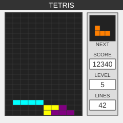

# PicoSystem Tetris

A Tetris implementation for the [Pimoroni PicoSystem](https://shop.pimoroni.com/products/picosystem),
with an SDL build so it can be developed and played on the desktop.



## Download

Grab the latest `picosystem-tetris.uf2` from the
[releases page](https://github.com/crustovsky/picosystem-tetris/releases), or
from the artifacts of any [build run](https://github.com/crustovsky/picosystem-tetris/actions)
if you want the bleeding edge.

To flash: hold **X** while powering the PicoSystem on to enter bootloader mode,
then copy the `.uf2` onto the `RPI-RP2` drive that appears. The device reboots
into the game on its own.

## Overview

Built for a 240x240 pixel display at 16bpp, with the game logic kept separate
from rendering so the same code drives both the handheld and the desktop build.
The board is a 10x20 grid of square 11x11 cells; blocks are drawn inset by one
pixel over black, so the gutter between them forms the grid for free.

## Architecture

The project is structured to allow for multiple display targets:

- **Game Logic**: Contained in `tetris_game.c/h` - handles all the game mechanics
- **Display Interface**: Contained in `tetris_display.c/h` - provides a unified drawing API and game-specific rendering 
- **Renderers**: Platform-specific implementations
  - PicoSystem: `tetris_display_picosystem.cpp` - PicoSystem implementation
  - SDL: `tetris_display_sdl.c` - Desktop implementation using SDL3

## File Structure

The implementation consists of the following files:

| File | Description |
|------|-------------|
| `tetris_game.h` | Game logic definitions and declarations |
| `tetris_game.c` | Game logic implementation |
| `tetris_display.h` | Display API and drawing function declarations |
| `tetris_display.c` | Implementation of display functions and renderer interface |
| `tetris_display_renderers.h` | Header defining renderer functions |
| `tetris_display_picosystem.cpp` | PicoSystem-specific rendering implementation |
| `tetris_display_sdl.c` | SDL3-specific rendering implementation |
| `tetris_main_pico.cpp` | Entry point and game loop for PicoSystem |
| `tetris_main_sdl.cpp` | Entry point and game loop for SDL |

## Game Components

### Game Logic (`tetris_game.h` & `tetris_game.c`)

#### Key Features:
- Standard 10×20 Tetris grid
- 7 classic tetromino shapes (I, O, T, S, Z, J, L)
- Piece movement and rotation with collision detection
- Line clearing and score calculation
- Level progression based on lines cleared
- Game states (active, paused, game over)

#### Core Functions:
- `initGame()` - Initialize the game state
- `updateGame(float tick)` - Update game state based on elapsed time
- `moveTetromino(Direction dir)` - Move the current piece
- `rotateTetromino()` - Rotate the current piece
- `hardDrop()` - Drop the current piece straight to its landing row
- `ghostDropY()` - Row the current piece would land on (used to draw the ghost)
- `clearLines()` - Clear full lines and update score

### Display Interface (`tetris_display.h` & `tetris_display.c`)

#### Display Layout (240×240):
- Game board: 110×220 pixels at (6, 10) — 10×20 grid of **square 11×11 cells**
- Side panel: 108 pixels wide at x=126 — next-piece preview and stats
- No title bar; the space is spent on the board instead

Blocks are drawn inset by 1 pixel over a black board, so the 1-pixel gutter
between them forms the grid without any separate grid-line drawing.

#### Renderer Interface:
The display system is now abstracted through a renderer interface:
```c
typedef struct {
    void (*init)();
    void (*clear)(uint16_t color);
    void (*drawRect)(int x, int y, int width, int height, uint16_t color);
    void (*fillRect)(int x, int y, int width, int height, uint16_t color);
    void (*drawText)(int x, int y, const char* text, uint16_t color);
    void (*update)();
} DisplayRenderer;
```

#### Tetris-Specific Drawing Functions:
- `drawBoard()` - Draw the board, the landing ghost and the current piece
- `drawNextPiece()` - Show preview of the next piece, centred on its bounding box
- `drawStats()` - Display score, level, and lines cleared
- `drawGameState()` - Show game over or paused message
- `drawGame()` - Main drawing function that calls all others

### Main Programs (`tetris_main_pico.cpp` & `tetris_main_sdl.cpp`)

#### PicoSystem Main (`tetris_main_pico.cpp`):
- PicoSystem initialization
- PicoSystem input handling
- PicoSystem lifecycle functions (init, update, draw)

#### SDL Main (`tetris_main_sdl.cpp`):
- SDL initialization
- SDL input handling
- SDL main loop with timing control

## Building

### For SDL (Desktop)

Needs [SDL3](https://github.com/libsdl-org/SDL) and a C/C++ compiler.

```bash
cmake -S . -B build_sdl
cmake --build build_sdl
./build_sdl/picosystem-tetris
```

### For PicoSystem

Needs the ARM bare-metal toolchain, the
[Pico SDK](https://github.com/raspberrypi/pico-sdk) (2.x) and the
[PicoSystem SDK](https://github.com/pimoroni/picosystem) (`main` — the `v1.0.0`
tag predates Pico SDK 2.x and will not build against it).

```bash
# Arch; see the Pico SDK docs for other distributions
sudo pacman -S arm-none-eabi-gcc arm-none-eabi-newlib arm-none-eabi-binutils

# Clone both SDKs next to this repo
cd ..
git clone https://github.com/crustovsky/picosystem-tetris.git
git clone --depth 1 --branch 2.3.0 https://github.com/raspberrypi/pico-sdk.git
git clone --depth 1 https://github.com/pimoroni/picosystem.git
cd picosystem-tetris

cmake -S . -B build_pico -DUSE_PICOSYSTEM=ON
cmake --build build_pico
```

`CMakeLists.txt` picks up `pico-sdk` and `picosystem` automatically when they
sit next to the repo; set `PICO_SDK_PATH` if yours live elsewhere. The Pico SDK
builds `picotool` on first configure to produce the `.uf2`, which needs
`libusb-1.0` development headers.

Use Pico SDK **2.3.0 or newer** on a modern host compiler. Earlier 2.x versions
fail to build the `pioasm` host tool under GCC 15/16, because recent libstdc++
no longer includes `<cstdint>` transitively; 2.3.0 adds the missing include.

This produces `build_pico/picosystem-tetris.uf2`; flash it as described under
[Download](#download).

## Controls

### PicoSystem
- **Left/Right/Down**: Move piece
- **A**: Rotate piece
- **Y**: Hard drop
- **B**: Pause/Unpause
- **X**: Restart after game over

### SDL
- **Arrow Keys**: Move and rotate piece
- **Space**: Hard drop
- **P**: Pause/Unpause
- **R**: Restart
- **ESC**: Quit

The SDL window opens at 3x scale (720×720) and is resizable; drawing always
happens in 240×240 coordinates and is integer-scaled to fit, so the desktop
build is pixel-identical to the PicoSystem one.

## Development

This project uses an abstraction layer for display rendering to make it easy to port to different platforms. The display renderer interface is defined in `tetris_display.h` and includes functions for basic drawing operations.

To add support for a new platform:
1. Create a new renderer implementation file (e.g., `tetris_display_myplatform.c`)
2. Implement the `DisplayRenderer` interface functions for your platform
3. Add a function to get your renderer (e.g., `getMyPlatformRenderer()`)
4. Update `tetris_display_renderers.h` to expose your new renderer
5. Update CMakeLists.txt to include your platform-specific build options

## Memory Usage

- Frame buffer: 240×240×2 bytes (115.2 KB) for 16bpp color
- Game state: Minimal (~1 KB)
- Code size: Small, suitable for embedded applications

## Performance Considerations

- Drawing optimizations for speed (using primitives like `fillRect`)
- Minimal dynamic memory allocation
- Efficient update logic with time-based movement

## Continuous integration

`.github/workflows/build.yml` builds the PicoSystem firmware on every push to
`main` and every pull request, uploading the `.uf2` as a build artifact. Pushing
a `v*` tag additionally publishes it to a GitHub release:

```bash
git tag v1.0.0 && git push origin v1.0.0
```

SDK versions are pinned in the workflow so builds stay reproducible. Only the
firmware is built in CI; the desktop SDL build is for local development.

## Licence

MIT — see [LICENSE](LICENSE).
